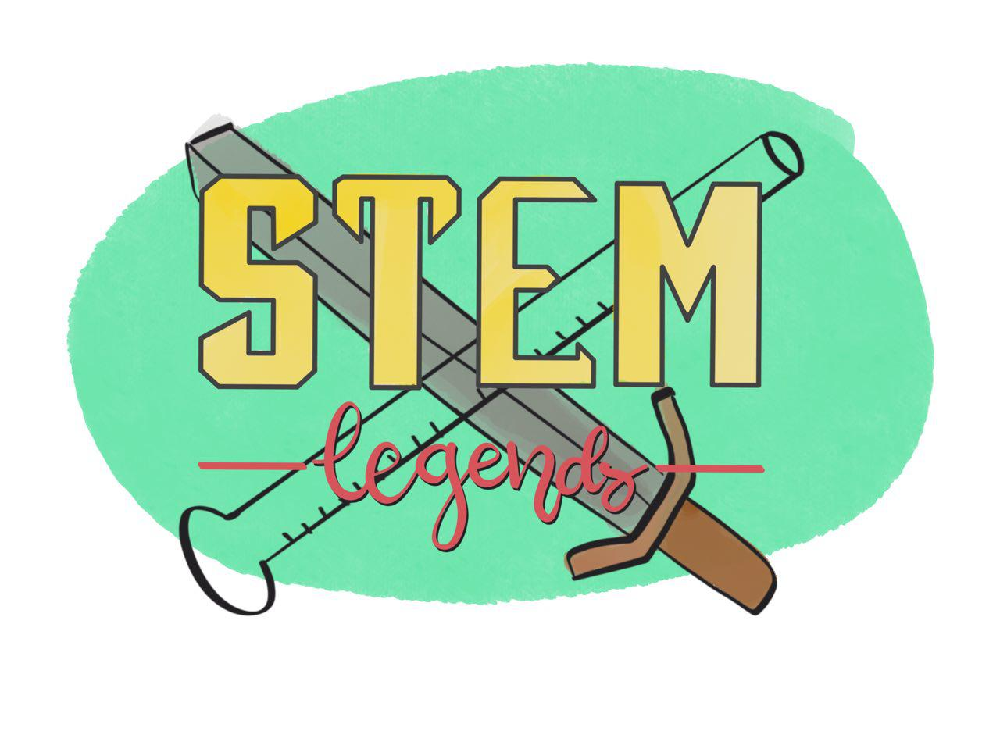

# STEMLegends
  
STEM Legends es un juego móvil infantil para fomentar el talento científico/tecnológico en niñas y visibilizar referentes femeninos en la industria
El repositorio inicial del proyecto se encuentra [aquí](https://github.com/davidcarvajalg/hackforgood2018)
